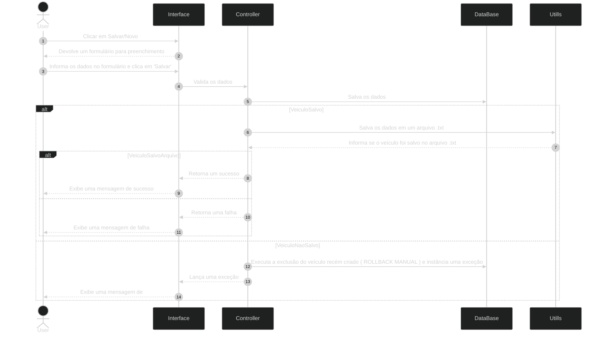

# SistemaCadastroVeiculos

# Tecnologia Usadas

    - Mermaid: Criação de Diagramas de Classes e Sequência
    - Padrão MVC: Aproveitando a separação de responsabilidades para um futuro escalonamento
    - Java 25
    - Maven
    - JavaFX: Renderização de telas e pop-ups
    - PostgreSQL 18: Armazenamento de longo prazo

# Diagrama de Sequência

 # 1 - Criar Veículo

# 2 - Editar Veículo

# Diagrama de Classes 

