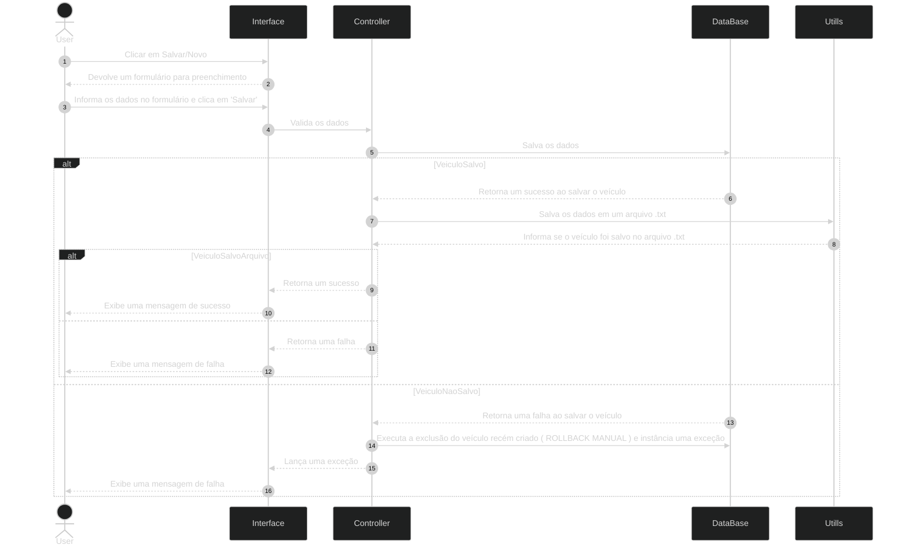
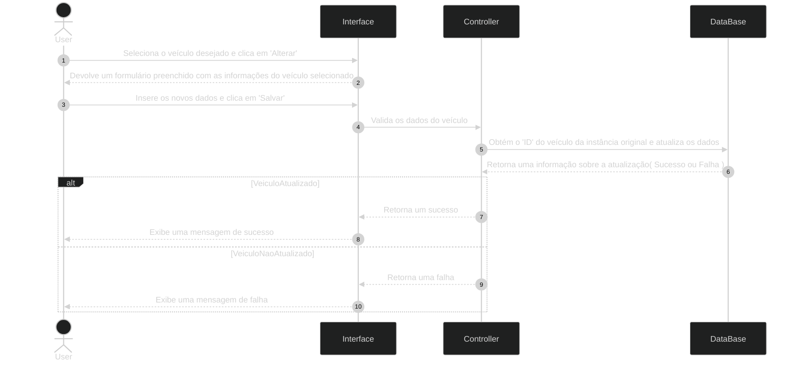
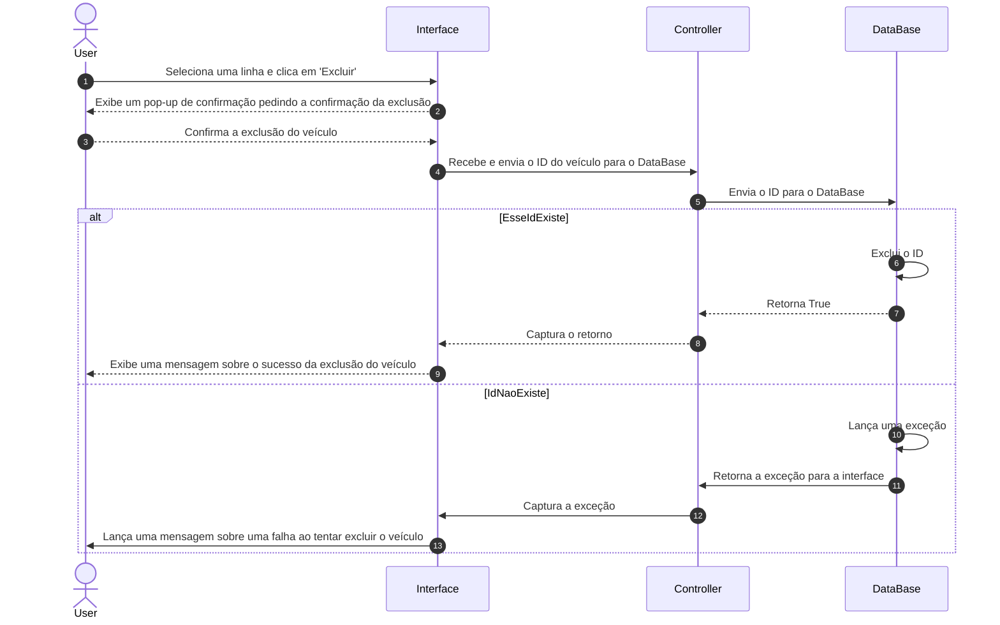

# 🚗 Sistema de Cadastro de Veículos

Aplicação desktop para gerenciamento e cadastro de veículos desenvolvida em **Java 25** com interface em **JavaFX**, utilizando arquitetura **MVC** e o padrão **Repository** para persistência em **PostgreSQL**.

---

## 🛠️ Tecnologias Utilizadas

* **Linguagem:** Java 25
* **Interface Gráfica:** JavaFX (renderização de telas e diálogos)
* **Gerenciador de Dependências:** Maven
* **Banco de Dados:** PostgreSQL 18 (persistência relacional)
* **Arquitetura:** MVC (Model-View-Controller) & Repository Pattern
* **Documentação Visual:** Mermaid (diagramas de classes e sequência)

---

## 🛡️ Validações e Regras de Negócio

Para garantir a consistência dos dados antes do envio ao banco de dados, o sistema executa verificações no momento do cadastro e da edição.

### 1. Validação de Campos Obrigatórios
Impede a entrada de valores `null` ou compostos apenas por espaços em branco nos campos de texto.

```java
if (nome == null || nome.trim().isEmpty() || 
    cor == null || cor.trim().isEmpty() || 
    modelo == null || modelo.trim().isEmpty()) {
    throw new IllegalArgumentException("Nenhum campo de texto pode ficar em branco!");
}
```

### 2. Conversão Númerica
Impede a entrada de valores alpha númericos ou letras no campo de ano.

```java
    try{
            anoParser = Integer.parseInt( anoStr );
        }catch( NumberFormatException nfe ){
            throw new IllegalArgumentException( "Digite um ano válido!" + nfe.getMessage() );
        }
```
### 3. Validação do Chassi
Impede a entrada de valores que não são baseados na norma ISO 3779( Excluindo as letras `I`, `O` e `Q` para evitar confusão com 1 e 0 ).

```java
    if (chassi == null || chassi.length() < 17) {
            throw new IllegalArgumentException("Tamanho inválido! Digite um tamanho de chassi corretamente. ");
    }

    String regexChassi = "^[A-HJ-NPR-Z0-9]{17}$";
    return chassi.toUpperCase().matches(regexChassi);
    
```
### 4. Validação da Placa
Impede a entrada de valores que não são baseados no formato tradicional do MercoSul ( `AAA1234` ou `AAA1A23` ).
```java
     if (placa == null || placa.length() < 7) {
            throw new IllegalArgumentException("Tamanho inválido! Uma placa deve ter 7 caracteres. ");
    }

    String regexPlaca = "^[A-Z]{3}[0-9]([A-Z]|[0-9])[0-9]{2}$";
    return placa.toUpperCase().matches( regexPlaca );
```


### REGEX utilizados
    > Para Chassi:
    `   
        if( chassi.length() < 17){
            throw new RuntimeException( "Tamanho inválido! Digite um tamanho de chassi corretamente! ");
        }

        // Pela minha experiência diária no setor automativo
        // E pelo que li em um forúm
        // Não é sempre permitido = acho que nem é - chassis iniciarem com 0
        String t1 = "^[A-HJ-NPR-Z0-9]{17}$";
        String t2 = chassi.toUpperCase();
        return t2.matches(t1);
    `
    > Para Placa:
    `
        if( placa.length() < 7 ){
            throw new RuntimeException( "Tamanho inválido! Digite um tamanho de placa corretamente!" );
        }
        
        String t1 = "^[A-Z]{3}[0-9]([A-Z]|[0-9])[0-9]{2}$";
        String t2 = placa.toUpperCase();
        return t2.matches(t1);
    `


# 🔄 Diagramas de Sequência

 # 1 - Criar Veículo
1. Criar Veículo
    Representa o fluxo de criação, validação, persistência no banco e backup auxiliar em arquivo de texto.



# 2 - Editar Veículo
Fluxo de alteração das informações de um veículo existente.


# 3 - Excluir Veículo
Fluxo de remoção de veículo por ID.



# 📐 Diagrama de Classes
Estrutura das classes e pacotes (models, controller, repository e view).

