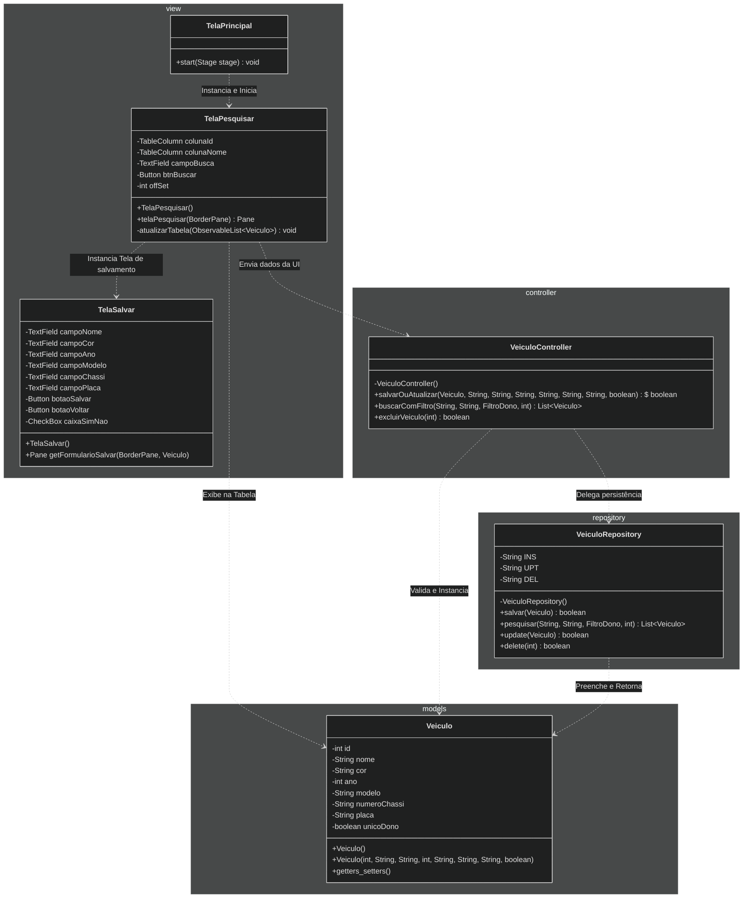

# SistemaCadastroVeiculos

# Tecnologia Usadas

    - Mermaid: Criação de Diagramas de Classes e Sequência;
    - Padrão MVC: Aproveitando a separação de responsabilidades para um futuro escalonamento;
    - Java 25;
    - Maven;
    - JavaFX: Renderização de telas e pop-ups;
    - PostgreSQL 18: Armazenamento de longa prazo

# Diagrama de Sequência

# Diagrama de Classes 

